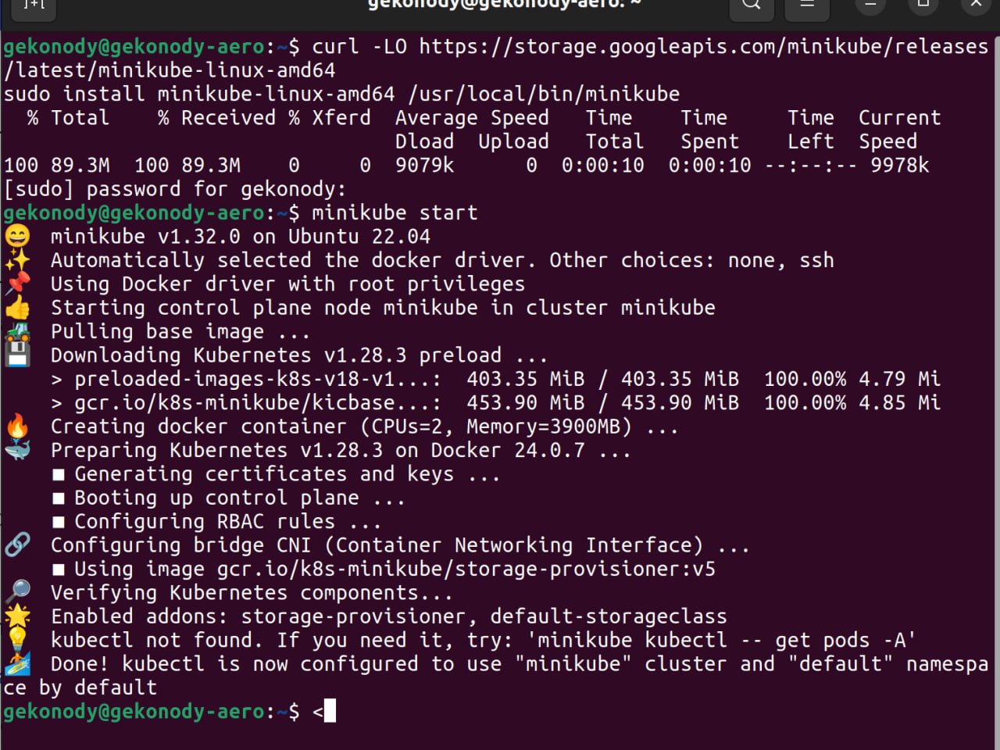
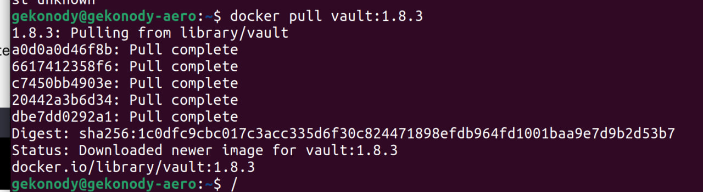
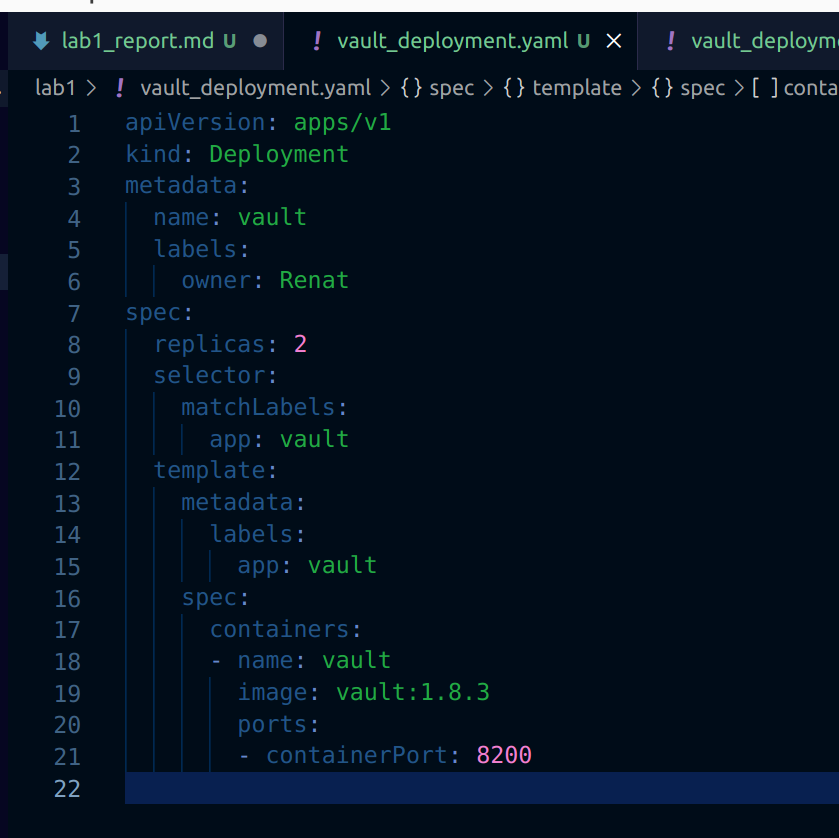
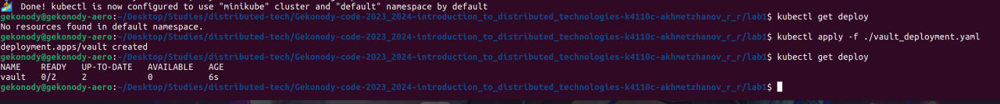
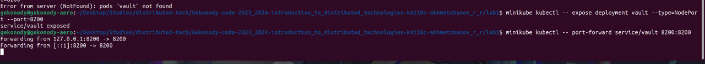
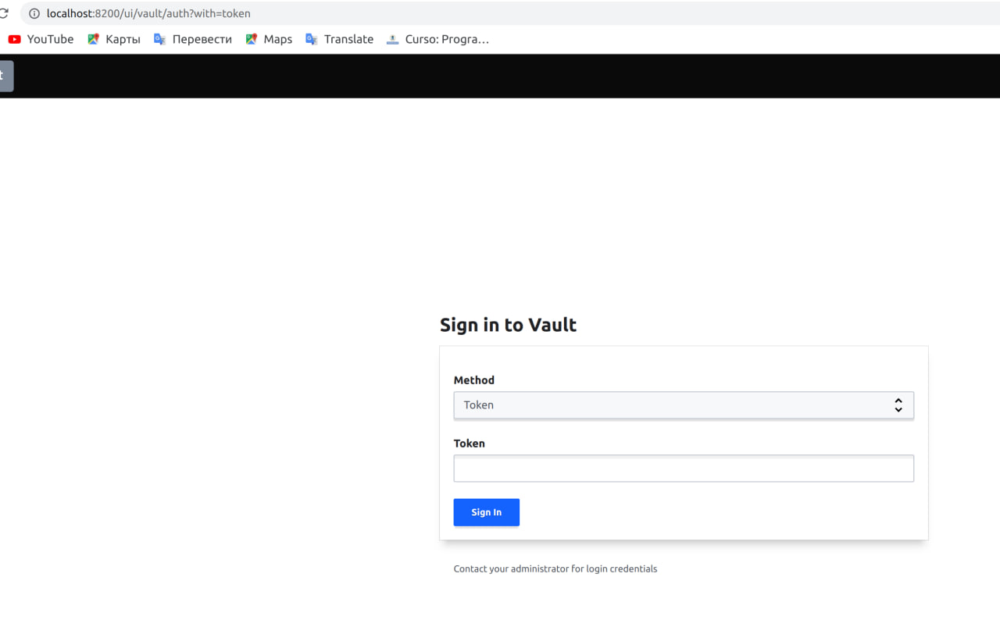
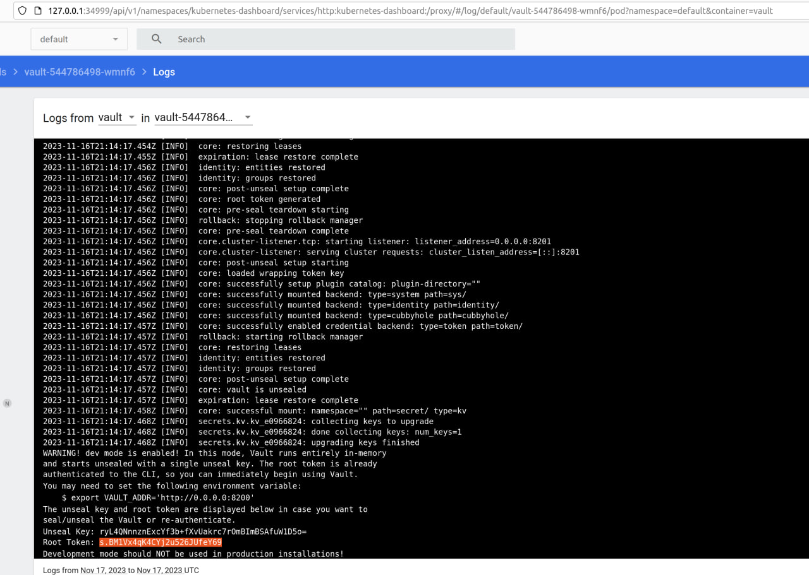
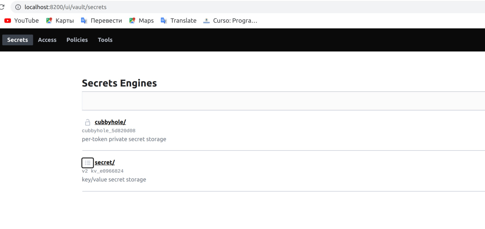
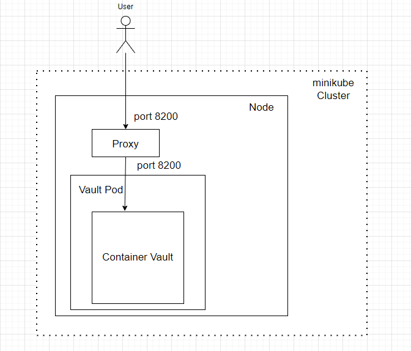

University: [ITMO University](https://itmo.ru/ru/)  
Faculty: [FICT](https://fict.itmo.ru)  
Course: [Introduction to distributed technologies](https://github.com/itmo-ict-faculty/introduction-to-distributed-technologies)
Year: 2023/2024  
Group: K4110c  
Author: Akhmetzhanov Renat Ruslanovich  
Lab: Lab1  
Date of create: 15.10.2023  
Date of finished:   

1.Устанавливаем и запускаем minikube.

2.Скачиваем контейнер vault 

3.Создаём yaml манифест для создания деплоймента.

4.Разворачиваем его в кластере.

5. Деплой сервиса и проброс порта

6.Открываем vault в браузере по заданному порту

7.Для получения токена для входа в vault открываем логи пода. Смотрим логи через графический интерфейс запуском minikube dashboard

8.Авторизация при помощи полученного токена.

Ответы на вопросы:

1. Было развернуто приложение для хранения секретов vault в кубере. Для этого был развернут один деплоймент с двумя подами и 1 сервис для подключения к нему.

2. Токен для входа в vault хранится в логах пода.

Схема

