University: [ITMO University](https://itmo.ru/ru/)  
Faculty: [FICT](https://fict.itmo.ru) 
Course: [Introduction to distributed technologies](https://github.com/itmo-ict-faculty/introduction-to-distributed-technologies) 
Year: 2023/2024 
Group: K4110c 
Author: Akhmetzhanov Renat Ruslanovich 
Lab: Lab3 
Date of create: 22.11.2023 
Date of finished:  

**1. Создаём ConfigMap со значениями переменных.** 
ConfigMap — это объект Kubernetes, который используется для хранения несекретных данных в паре «ключ-значение». Поды могут использовать их как переменные окружения или как файлы конфигурации в Volume. 

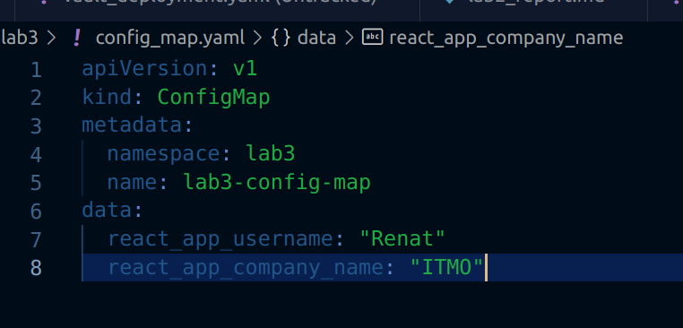

**2. Создаём ReplicaSet, в который передаём указанные переменные.** 
ReplicaSet — это процесс, который запускает несколько экземпляров модуля pod и сохраняет указанное количество модулей pod постоянными 

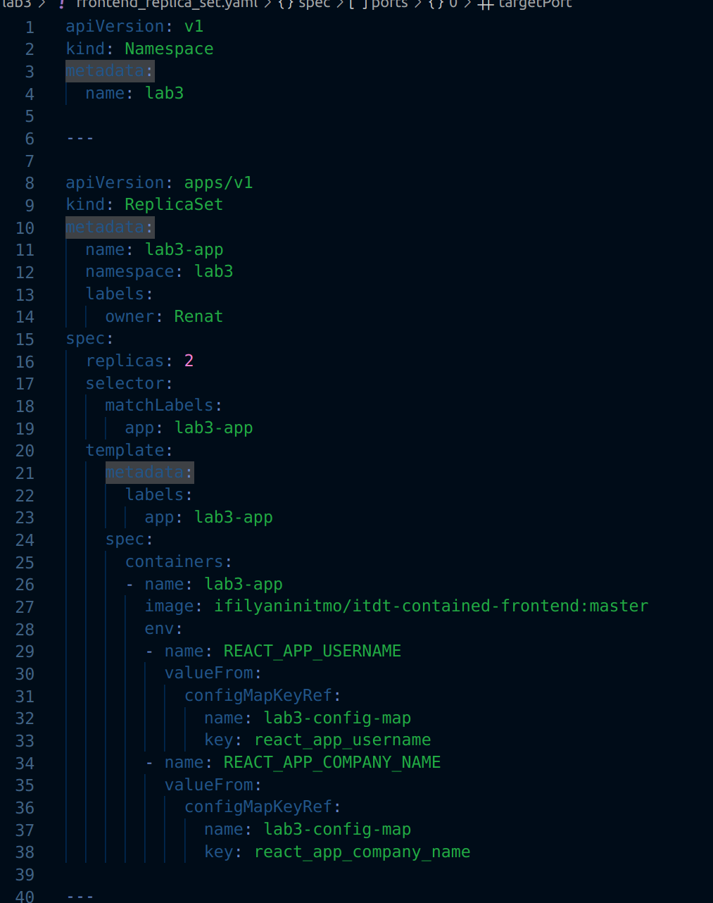

**3. Создаем Service для доступа к приложению** 
Сервис Kubernetes (Service) — это уровень абстракции, который определяет логический набор подов, перенаправляет внешний трафик, балансирует нагрузку и реализует service discovery для этих подов

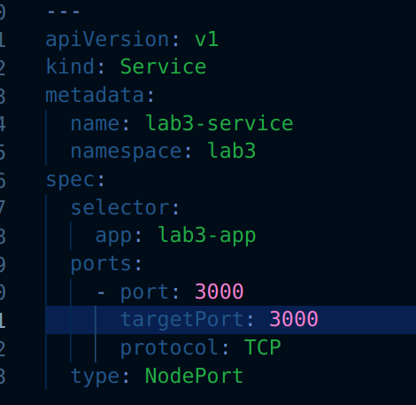

**4. Создаем сертификат и импортируем его в Secret** 
В кластере Kubernetes объекты типа секрет Secret предназначены для хранения конфиденциальной информации, такой как пароли, OAuth-токены или ssh-ключи.

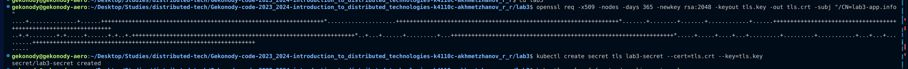 

**5. Создаем Ingress и указываем в нем созданный секрет и домен**  
Ingress— это набор правил внутри вашего кластера, предназначенных для того, чтобы входящие подключения могли достичь сервисов (Services) ваших приложений.

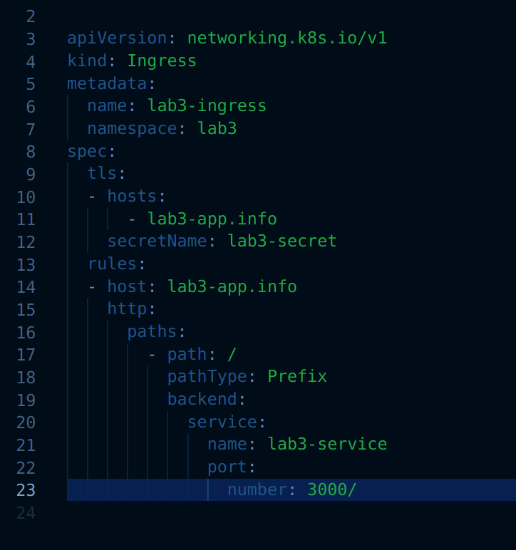  

**6. Применяем все вышенаписанные манифесты, для создания всех объектов и проверяем их создание**  

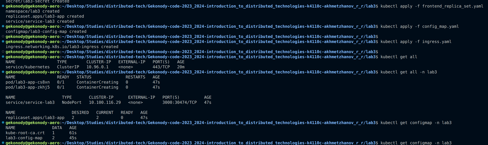

**7. Включаем в minikube аддон с ingress.** 

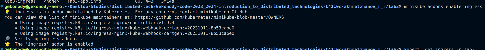

**8. Прописываем в файле /etc/hosts адрес minikube и домен**  

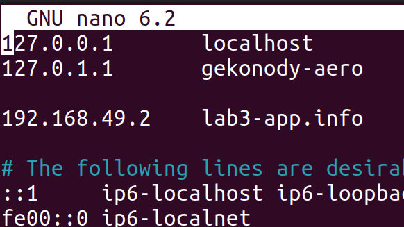 

**9. Включаем туннель в minikube и переходим в бразуере по адресу `https://lab3-app.info`.**  

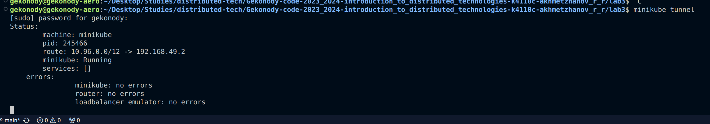

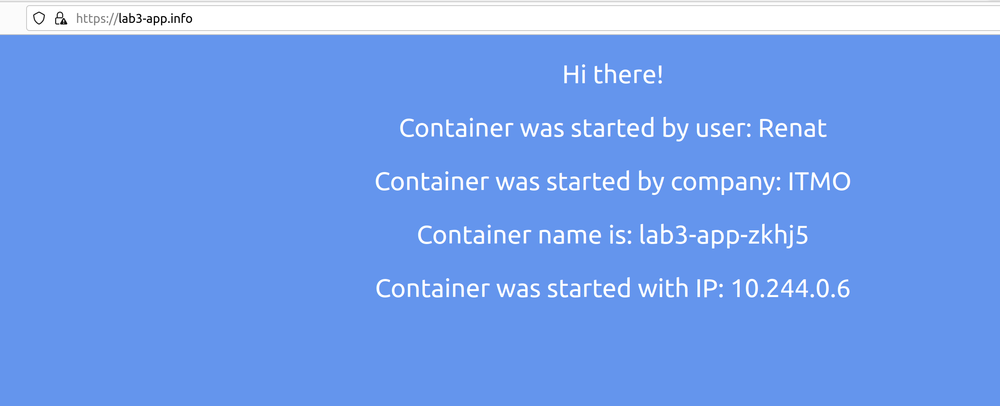

**10. Сертификат.** 
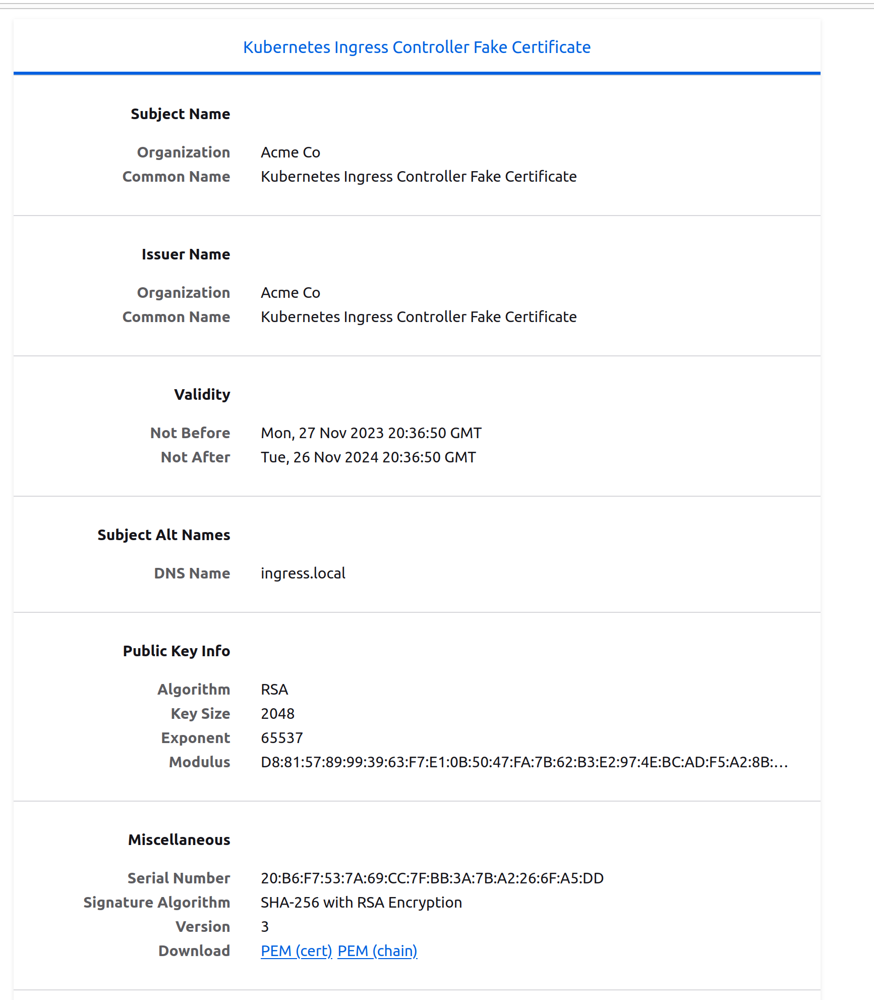  

**11. Схема.** 
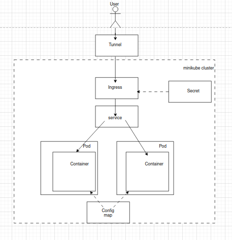

