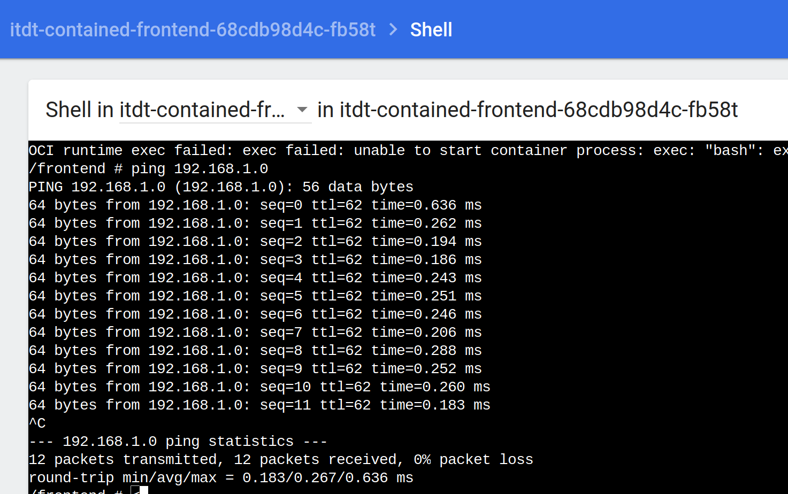

University: [ITMO University](https://itmo.ru/ru/)
Faculty: [FICT](https://fict.itmo.ru)
Course: [Introduction to distributed technologies](https://github.com/itmo-ict-faculty/introduction-to-distributed-technologies)
Year: 2023/2024
Group: K4110c
Author: Akhmetzhanov Renat Ruslanovich
Lab: Lab3
Date of create: 28.11.2023
Date of finished: 

1.Запускаем minikube с подключенным плагином CNI=calico, режимом работы Multi-Node Clusters и разворачиваем 2 ноды 

2.Проверяем количество нод и подов calico

3.Помечаем ноды по географическому положению

4.Создание файла манифеста для назначения пула IP узлам на основе их меток.

5.Удаляем дефолтный Ippools перед созданием своих и создаем свои

6.Создаем деплоймент приложения

7.Проверяем, какие ip адреса были назначены. Адреса из тех ippool которые мы создавали, следовательно, всё настроено верно.

8.Создаем сервис и прокидываем 3000 порт

9.Заходим на сайт и видим, что все настроено верно и ip контейнера назначен верно. Container name и Container IP могут меняться, в зависимости от того, на какой под попал запрос.

10.Заходим в один из подов и пингуем соседний 

11. Схема

